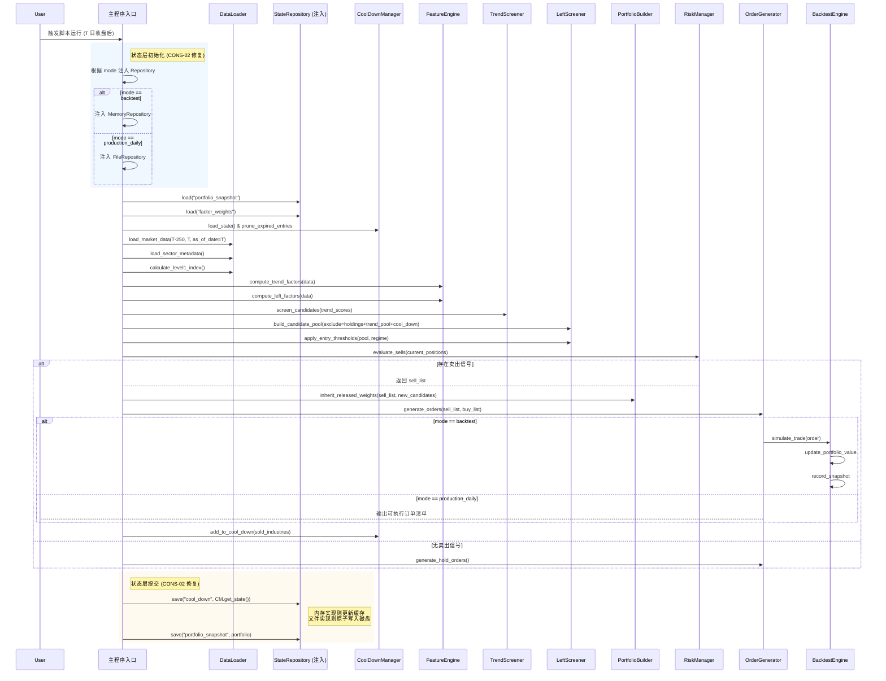

# 四级行业双轨筛选系统接口架构设计

| 文档版本 | v1.2                 |
|:---- |:------------------------------------------------ |
| 最后更新 | 2024-05-22                                       |
| 关联文档 | 《四级行业双轨筛选系统 - 数据库结构说明书》 <br> 《四级行业双轨筛选系统技术规格说明书》 |

## 

## 一、系统架构概览

本系统采用七层模块化架构，严格遵循“双轨物理隔离”与“零数据库变更”原则。整体流程为：数据层提供输入，经特征层处理后，由独立的筛选层分别生成趋势与左侧轨道候选列表，组合层进行权重分配与合并，风控层执行动态调仓判断，状态层管理跨日持久化信息，最终由执行层输出交易指令。

### 1.1 架构流程图

```mermaid
graph TD
    A[执行层] --> B[组合层]
    B --> C[风控层]
    C --> D[筛选层]
    D --> E[特征层]
    E --> F[数据层]
    G[状态层] --> D
    G --> C
    G --> B
    F --> H[(只读数据库)]

    subgraph  "双轨物理隔离  "
        D1[TrendScreener] -->|独立计算 | E
        D2[LeftScreener] -->|独立计算 | E
    end

    subgraph  "状态存储抽象 (CONS-02 修复)  "
        G1[MemoryRepository] -.->|Backtest| G
        G2[FileRepository] -.->|Production| G
    end

    style A fill:#f9f,stroke:#333;
    style B fill:#bbf,stroke:#333;
    style C fill:#f96,stroke:#333;
    style D fill:#6f9,stroke:#333;
    style E fill:#6cf,stroke:#333;
    style F fill:#ccc,stroke:#333;
    style G fill:#fd9,stroke:#333;
    style H fill:#ddd,stroke:#333;
    style G1 fill:#eee,stroke:#333,stroke-dasharray: 5 5;
    style G2 fill:#eee,stroke:#333,stroke-dasharray: 5 5;
```

### 1.2 模块职责说明

| 编号  | 模块名称 | 核心职责                                                    | 关键约束遵循情况                      |
|:--- |:---- |:------------------------------------------------------- |:----------------------------- |
| 1   | 数据层  | 从 PostgreSQL 只读视图加载历史行情与行业映射数据，执行 PIT 切片防止未来函数          | ✅ 零数据库变更、✅ 防未来函数、✅ 字段全量映射     |
| 2   | 特征层  | 执行轨道内独立的因子计算、标准化（横截面排名/时间序列分位）、去冗余（聚类+ICIR 加权）          | ✅ 双轨物理隔离、✅ 因子 IC 自适应          |
| 3   | 筛选层  | 实施趋势轨道漏斗筛选（L2→L3→L4）与左侧轨道候选池准入过滤，排除冷却池行业                | ✅ 双轨物理隔离、✅ 冷却机制、✅ 事件驱动基础      |
| 4   | 组合层  | 权重分配（显式 85%:15%）、暴露度控制（L1≤20%, L2≤10%）、总持仓数量限制（15-25 个） | ✅ 波动率目标控仓、✅ 回测/实盘一致性          |
| 5   | 风控层  | 动态止损判断（ATR、固定比例）、持有期到期、评分跌破、异常波动；执行波动率目标降仓逻辑            | ✅ 止损机制、✅ 波动率控仓、✅ 防过度交易        |
| 6   | 状态层  | 仓储模式管理状态。回测注入内存实现，实盘注入文件实现。核心更新逻辑无分支。                   | ✅ 零数据库变更、✅ 脚本化运行、✅ CONS-02 合规 |
| 7   | 执行层  | 生成订单指令（T+1 开盘执行）、模拟回测引擎、应用交易成本与滑点模型                     | ✅ 回测/实盘一致性、✅ 防未来函数            |

---

## 二、核心接口定义

本系统采用清晰的面向对象设计，各模块通过明确定义的接口进行交互。以下为基于 Python 3.10+ 类型系统的类图与关键方法签名。

### 2.1 模块类图

```mermaid
classDiagram
    class DataLoader {
        +load_sector_metadata() dict[int, SectorMeta]
        +load_industry_mapping() pd.DataFrame
        +load_market_data(start_date: date, end_date: date, as_of_date: date) pd.DataFrame
        +calculate_level1_index(data: pd.DataFrame) pd.Series
    }

    class SectorMapper {
        +map_to_hierarchy(industry_name: str, level: int) Optional[HierarchyPath]
        +get_child_industries(parent_id: int) list[int]
        +validate_pit_consistency(trade_date: date, industry_id: int) bool
    }

    class FeatureEngine {
        +compute_trend_factors(pd.DataFrame) pd.DataFrame
        +compute_left_factors(pd.DataFrame) pd.DataFrame
        +apply_sanitization(raw_scores: dict) dict
        +perform_intra_track_decorrelation(scores: dict, track: str) dict
    }

    class Normalizer {
        +rank_cross_sectional(scores: np.ndarray) np.ndarray
        +percentile_then_rank(scores: np.ndarray, window: int) np.ndarray
        +normalize_weights(weights: dict) dict
    }

    class TrendScreener {
        +screen_candidates(trend_scores: dict) list[SelectedIndustry]
        +apply_exposure_constraints(selected: list) list
        +enforce_fundamental_rules()
    }

    class LeftScreener {
        +build_candidate_pool(exclude_list: list) list[str]
        +apply_entry_thresholds(pool: list, regime: str) list[str]
        +select_top_k_final(pool: list, k: int) list[SelectedIndustry]
    }

    class PortfolioBuilder {
        +merge_tracks(trend_list: list, left_list: list, target_trend_weight: float, target_left_weight: float) Portfolio
        +allocate_initial_weights(portfolio: Portfolio)
        +inherit_released_weights(released_weight: float, new_industries: list)
    }

    class WeightAllocator {
        +apply_volatility_target(portfolio: Portfolio, forecast_vol: float) float
        +calculate_tracking_error(constraints: ExposureConstraints) float
    }

    class RiskManager {
        +should_sell_atr_drawdown(industry: IndustryPosition) bool
        +should_sell_fixed_drawdown(industry: IndustryPosition) bool
        +should_sell_on_score_drop(industry: IndustryPosition) bool
        +should_force_exit_on_vol_spikes(industry: IndustryPosition) bool
        +is_position_expired(industry: IndustryPosition) bool
    }

    class CoolDownManager {
        +is_in_cool_down(industry_id: int, as_of_date: date) bool
        +add_to_cool_down(industry_id: int, sell_date: date)
        +prune_expired_entries(current_date: date)
        +get_state() dict
    }

    class StateRepository {
        <<interface>>
        +load(key: str) Any
        +save(key: str, data: Any)
    }

    class MemoryRepository {
        +load(key: str) Any
        +save(key: str, data: Any)
    }

    class FileRepository {
        +load(key: str) Any
        +save(key: str, data: Any)
    }

    class OrderGenerator {
        +generate_orders(sell_list: list, buy_list: list) list[Order]
        +apply_slippage_cost(order: Order, mode: str) float
        +determine_execution_price(mode: str) float
    }

    class BacktestEngine {
        +simulate_trade(order: Order, price: float, cost: float)
        +update_portfolio_value(date: date)
        +record_snapshot(portfolio: Portfolio)
    }

    DataLoader --> SectorMapper
    FeatureEngine --> Normalizer
    TrendScreener --> CoolDownManager
    LeftScreener --> CoolDownManager
    PortfolioBuilder --> WeightAllocator
    RiskManager --> CoolDownManager
    CoolDownManager --> StateRepository
    MemoryRepository ..|> StateRepository
    FileRepository ..|> StateRepository
    OrderGenerator --> BacktestEngine
```



### 2.2 关键方法详细签名与说明

| 模块  | 类名               | 方法名                          | 输入参数                                                                                                           | 返回值                     | 核心职责与合规说明                                                                  |
|:--- |:---------------- |:---------------------------- |:-------------------------------------------------------------------------------------------------------------- |:----------------------- |:-------------------------------------------------------------------------- |
| 数据层 | DataLoader       | load_market_data()           | start_date: date, end_date: date, **as_of_date: date**                                                         | pd.DataFrame            | 按 PIT 原则加载。字段严格对应 `fin.daily_sector_industry_cn`。**禁止使用 SELECT ***。        |
| 数据层 | DataLoader       | **calculate_level1_index()** | data: pd.DataFrame                                                                                             | pd.Series               | **Tech-3.7 单一可信源**。统一计算 Level 1 市值加权指数，禁止重复实现。                             |
| 数据层 | SectorMapper     | map_to_hierarchy()           | industry_name: str, level: int                                                                                 | Optional[HierarchyPath] | 映射四级路径。字段严格对应 `dim.vw_asset_cn_csi_sectors` (`csi_sector_level1` 等)。       |
| 数据层 | SectorMapper     | validate_pit_consistency()   | trade_date: date, industry_id: int                                                                             | bool                    | **DB-03 防未来函数**。校验行业映射在指定交易日期是否有效。                                         |
| 特征层 | FeatureEngine    | compute_trend_factors()      | data: pd.DataFrame                                                                                             | pd.DataFrame            | 计算趋势轨道 5 类因子。轨道内标准化。                                                       |
| 特征层 | FeatureEngine    | compute_left_factors()       | data: pd.DataFrame                                                                                             | pd.DataFrame            | 计算左侧轨道 5 类因子。轨道内标准化。                                                       |
| 筛选层 | TrendScreener    | screen_candidates()          | trend_scores: dict                                                                                             | list[SelectedIndustry]  | 执行 L2→L3→L4 漏斗筛选。独立于左侧轨道。                                                  |
| 筛选层 | LeftScreener     | apply_entry_thresholds()     | pool: list, regime: str                                                                                        | list[str]               | 根据市场状态应用动态阈值。独立于趋势轨道。                                                      |
| 组合层 | PortfolioBuilder | merge_tracks()               | trend_list: list, left_list: list, **target_trend_weight: float = 0.85**, **target_left_weight: float = 0.15** | Portfolio               | **STRAT-02 硬约束**。显式声明权重比例，禁止隐式配置。                                          |
| 风控层 | RiskManager      | should_sell_atr_drawdown()   | industry: IndustryPosition                                                                                     | bool                    | 判断 ATR 动态止损。                                                               |
| 状态层 | CoolDownManager  | add_to_cool_down()           | industry_id: int, sell_date: date                                                                              | None                    | **CONS-02 修复**。无论模式，均更新内存状态对象。                                             |
| 状态层 | StateRepository  | save()                       | key: str, data: Any                                                                                            | None                    | **CONS-02 修复**。统一接口。回测注入 `MemoryRepository`，实盘注入 `FileRepository`。核心调用无分支。 |
| 状态层 | FileRepository   | save()                       | key: str, data: Any                                                                                            | None                    | **Tech-7.1 原子写入**。必须实现 `tempfile` -> `checksum` -> `os.replace` 流程。        |
| 执行层 | OrderGenerator   | generate_orders()            | sell_list: list, buy_list: list, mode: str                                                                     | list[Order]             | 生成 T+1 开盘执行订单。                                                             |
| 执行层 | BacktestEngine   | simulate_trade()             | order: Order, price: float, cost: float                                                                        | None                    | 回测模拟成交。                                                                    |

---

## 三、数据结构定义

本系统采用 Python 3.10+ 的 `dataclass` 与类型注解定义所有核心数据结构。特别注意数据库字段名的严格映射。

### 3.1 行业元数据与层级路径

```python
from dataclasses import dataclass
from datetime import date, datetime
from typing import Dict, List, Optional, Literal
import pandas as pd

@dataclass
class SectorMeta:
    """行业元数据 (对应 dim.sector_industry_cn)"""
    id: int           # 对应 id (bigint)
    name: str         # 对应 name (text)
    level: int        # 对应 level (integer)

@dataclass
class HierarchyPath:
    """行业四级完整路径 (对应 dim.vw_asset_cn_csi_sectors)"""
    csi_sector_level1: str                    # 对应 csi_sector_level1
    csi_sector_level2: str                    # 对应 csi_sector_level2
    csi_sector_level3: str                    # 对应 csi_sector_level3
    csi_sector_level4: str                    # 对应 csi_sector_level4
    sector_industry_id: int                   # 对应的行业 ID
```

### 3.2 市场行情与因子得分

```python
@dataclass
class MarketDataPoint:
    """单条行业日频行情记录 (对应 fin.daily_sector_industry_cn)"""
    trade_date: date               # 对应 trade_date
    sector_industry_id: int        # 对应 sector_industry_id
    open: float                    # 对应 open
    high: float                    # 对应 high
    low: float                     # 对应 low
    close: float                   # 对应 close
    front_adj_close: float         # 对应 front_adj_close
    turnover_rate: float           # 对应 turnover_rate (DB Spec 2.3)
    amount: float                  # 对应 amount (DB  Spec 2.3)
    total_market_cap: float        # 对应 total_market_cap
    daily_mfv: float               # 对应 daily_mfv
    ma_10: float                   # 对应 ma_10
    ma_20: float                   # 对应 ma_20
    ma_60: float                   # 对应 ma_60
    volatility_20: float           # 对应 volatility_20
    cmf_10: float                  # 对应 cmf_10
    cmf_20: float                  # 对应 cmf_20
    cmf_60: float                  # 对应 cmf_60
    created_ts: datetime           # 对应 created_ts (DB Spec 2.3)

@dataclass
class FactorScores:
    """原始因子得分集合"""
    momentum: Optional[float]
    structure: Optional[float]
    technical: Optional[float]
    relative_strength: Optional[float]
    quality: Optional[float]

@dataclass
class StandardizedScore:
    """标准化后综合得分 (0-100 分制)"""
    trend: Optional[float] = None
    left: Optional[float] = None
```

### 3.3 筛选结果与持仓组合

```python
@dataclass
class SelectedIndustry:
    """筛选出的行业记录"""
    sector_id: int
    name: str
    level: int
    full_path: HierarchyPath
    score: float
    entry_date: date
    holding_days: int = 0

@dataclass 
class IndustryPosition:
    """当前持仓头寸"""
    industry: SelectedIndustry
    weight: float
    entry_price: float
    current_price: float
    unrealized_pnl: float

@dataclass
class Portfolio:
    """投资组合快照"""
    trend_track: List[IndustryPosition]
    left_track: List[IndustryPosition]
    cash_ratio: float
    total_value: float
    timestamp: datetime
```

### 3.4 风控与执行相关结构

```python
@dataclass
class ExposureConstraints:
    """暴露度控制约束"""
    max_l1_exposure: float = 0.20
    max_l2_exposure: float = 0.10
    min_holdings: int = 15
    max_holdings: int = 25

@dataclass
class CoolDownRecord:
    """冷却池记录"""
    industry_id: int
    sell_date: date
    unlock_date: date

@dataclass
class Order:
    """交易订单指令"""
    sector_id: int
    action: Literal["BUY", "SELL"]
    quantity: float
    target_weight: float
    execution_price: Optional[float] = None
    slippage_cost: float = 0.0
    commission: float = 0.0
    signal_date: date = None
    execution_date: date = None

@dataclass
class SystemConfig:
    """系统运行配置"""
    mode: Literal["backtest", "production_daily"]
    transaction_cost: Dict
    risk_control: Dict
    screening: Dict
    state_files: Dict[str, str]
```

---

## 四、数据流转与时序 (CONS-02 修复版)

系统采用事件驱动的执行流程。关键修正：状态层的 `save` 操作在所有模式下均被调用，通过依赖注入不同的 `Repository` 实现来区分存储介质，确保核心逻辑路径无分支。

### 4.1 典型运行流程时序图



### 4.2 回测与实盘模式差异说明 (修正后)

| 差异维度    | 回测模式 (backtest)        | 实盘模式 (production_daily) | 合规性说明                            |
|:------- |:---------------------- |:----------------------- |:-------------------------------- |
| 状态存储实现  | 注入 `MemoryRepository`  | 注入 `FileRepository`     | **CONS-02 修复**：通过多态而非条件分支实现差异。   |
| 核心逻辑流   | 调用 `repository.save()` | 调用 `repository.save()`  | **完全一致**。调用点相同，参数相同。             |
| 冷却池管理   | 内存字典更新                 | JSON 文件原子写入             | 逻辑更新 (`add_to_cool_down`) 完全一致。  |
| 交易执行    | `BacktestEngine` 模拟成交  | `OrderGenerator` 输出订单   | 执行层差异，不影响策略核心逻辑。                 |
| 滑点模型    | 固定双边成本 0.2% + 滑点 0.1%  | 基于成交额分档估算               | 配置驱动，逻辑一致。                       |
| 初始化行为   | 无快照则空仓                 | 无快照则空仓                  | 逻辑一致。                            |
| IC 监控反馈 | 记录 IC 序列               | 记录 IC 序列 + 更新权重文件       | 权重更新通过 `repository.save()` 统一处理。 |

---

## 五、配置管理设计

系统的配置管理采用中心化的 `config.yaml` 文件。修正点：在组合层配置中显式声明权重比例，且本章节内容为完整配置，无任何省略。关键修正：`storage` 配置项明确为 `"repository_injected"`，避免误导。

### 5.1 `config.yaml` 完整示例 (修正版)

```yaml
system:
  version: "4.3"
  mode: "production_daily"  # 唯一真理源：决定存储是 File 还是 Memory
  data_source:
    pit_enabled: true

state_management:
  files:
    cool_down: "data/state_cool_down.json"
    weights: "data/state_factor_weights.json"
    snapshot: "data/state_portfolio_snapshot.csv"
  atomic_write: true
  checksum_enabled: true

scoring:
  isolation:
    enabled: true
    standardization:
      trend: "cross_sectional_rank"
      left: "time_series_percentile_then_cross_section"
    orthogonalization:
      method: "correlation_clustering"
      threshold: 0.7
      scope: "intra_track_only"

  left_track:
    regime_weights:
      bear_high_vol:
        shadow: 0.37
        bias: 0.30
        slow: 0.19
        flow: 0.12
        vol_shadow: 0.11
      bear_low_vol: 
        shadow: 0.32
        bias: 0.26
        slow: 0.22
        flow: 0.17
        vol_shadow: 0.12
      chop:
        shadow: 0.26
        bias: 0.24
        slow: 0.21
        flow: 0.23
        vol_shadow: 0.13
      bull:
        shadow: 0.19
        bias: 0.12
        slow: 0.16
        flow: 0.41
        vol_shadow: 0.12
      unknown:
        shadow: 0.26
        bias: 0.24
        slow: 0.21
        flow: 0.23
        vol_shadow: 0.13

  trend_track:
    level_weights:
      level4:
        momentum: 0.30
        structure: 0.15
        technical: 0.10
        relative_strength: 0.35
        quality: 0.10
      level3:
        momentum: 0.25
        structure: 0.15
        technical: 0.10
        relative_strength: 0.25
        quality: 0.25
      level2:
        momentum: 0.20
        structure: 0.15
        technical: 0.10
        relative_strength: 0.30
        quality: 0.25

portfolio:
  target_weights:
    trend_track: 0.85
    left_track: 0.15

data_processing:
  sanity_check:
    enabled: true
    max_daily_return: 0.30
    min_price: 0.01
  missing_value:
    strategy: "skip"
  outlier:
    method: "winsorization"
    percentiles: [0.01, 0.99]
  early_data:
    min_window_days: 60

screening:
  funnel:
    level2_top_n: 8
    level3_top_n: 2
    level4_top_n: 1
  left_track:
    entry_score_threshold: 65
    threshold_decay_step: 5
    max_decay_steps: 2
  cool_down:
    enabled: true
    days: 10
    scope: "global"
    storage: "repository_injected"  # 修正：此项仅占位，实际由 system.mode 强制决定

rebalancing:
  type: "event_driven"
  trigger_signals:
    - "stop_loss_atr"
    - "stop_loss_fixed"
    - "hold_period_expire"
    - "score_drop"
  weight_allocation:
    method: "inherit_and_split"

risk_control:
  volatility_target:
    enabled: true
    target_vol: 0.15
    model: "ewma"
    lambda: 0.94
    window: 20
  cash_management:
    idle_cash_yield: 0.02

  transaction_cost:
    backtest:
      commission: 0.001
      slippage: 0.001
    production_daily:
      tiered_slippage: true
      volume_window: 20

deployment:
  execution_timing:
    signal_generation: "T_close_after"
    order_execution: "T+1_open"
  ic_monitoring:
    review_frequency: "monthly"
    auto_downweight_threshold: 0.30
    ic_forward_days: 5
  health_metrics:
    - "cool_down_hit_rate"
    - "left_track_empty_frequency"
```

---

## 六、项目目录结构建议

```text
four_level_sector_system/
│
├── config.yaml                    # 主配置文件
├── main.py                        # 系统唯一入口脚本
│
├── data/                          # 持久化状态数据目录
│   ├── state_cool_down.json       # 仅生产模式使用
│   ├── state_factor_weights.json  # 仅生产模式使用
│   └── state_portfolio_snapshot.csv # 仅生产模式使用
│
├── modules/                       # 核心业务逻辑模块
│   ├── data_layer.py              # DataLoader, SectorMapper
│   ├── feature_layer.py           # FeatureEngine, Normalizer
│   ├── screening_layer.py         # TrendScreener, LeftScreener
│   ├── portfolio_layer.py         # PortfolioBuilder (含显式权重)
│   ├── risk_layer.py              # RiskManager, CoolDownManager
│   ├── state_layer.py             # StateRepository, MemoryRepository, FileRepository
│   └── execution_layer.py         # OrderGenerator, BacktestEngine
│
├── utils/                         # 公共工具函数库
│   ├── io.py                      # 原子写入工具 (供 FileRepository 使用)
│   ├── validation.py              # 数据质量检查
│   └── metrics.py                 # 绩效计算
│
└── tests/                         # 单元测试与集成测试用例
    ├── test_data_loader.py         # 验证数据库连接与 PIT 切片正确性
    ├── test_feature_engine.py     # 测试因子计算与标准化逻辑一致性
    ├── test_state_repository.py   # 测试内存与文件实现的一致性
    └── test_end_to_end.py          # 端到端流程测试（回测模式）
```

### 6.1 关键设计说明

1. **`state_layer.py` 重构 (CONS-02 核心)**：
   
   * 定义抽象基类 `StateRepository`，包含 `load()` 和 `save()` 方法。
   * 实现 `MemoryRepository`：数据存储在类变量或实例字典中，`save()` 操作仅更新内存。
   * 实现 `FileRepository`：数据存储在本地 JSON/CSV，`save()` 操作执行原子写入（**临时文件->校验和验证->`os.replace` 覆盖**），防止脚本中断导致文件损坏。
   * 合规性：`main.py` 根据配置实例化其中一个实现并注入给 `CoolDownManager` 和 `PortfolioBuilder`。核心业务代码只调用 `repository.save()`，无 `if mode == ...` 分支。

2. **`portfolio_layer.py` 修正 (STRAT-02 核心)**：
   
   * `PortfolioBuilder.merge_tracks()` 方法签名强制要求 `target_trend_weight` 和 `target_left_weight` 参数，默认值设为 **0.85** 和 **0.15**，防止隐式依赖配置文件导致的不一致。

3. **数据库字段严格映射 (DB-01/DB-03 核心)**：
   
   * `DataLoader` 中所有 SQL 查询必须显式指定字段名（如 `csi_sector_level1`, `sector_industry_id`, `front_adj_close`, `turnover_rate`, `amount`），禁止使用 `SELECT *`，确保与《数据库结构说明书》完全一致。
   * `DataLoader.load_market_data` 必须包含 `as_of_date` 参数，用于 PIT 校验。

4. **零 DDL 承诺**：
   
   * 本设计文档及代码实现中不包含任何 CREATE/ALTER INDEX 建议，数据库性能优化由 DBA 独立负责。应用层仅执行 SELECT 操作。

5. **单一可信源 (Tech-3.7 核心)**：
   
   * `DataLoader.calculate_level1_index` 是计算 Level 1 指数的唯一入口，禁止在特征层或组合层重复实现指数计算逻辑。

6. **测试覆盖 (RUN-02 验证)**：
   
   * 新增 `test_state_repository.py`，验证 `MemoryRepository` 和 `FileRepository` 在相同输入下产生的状态对象序列化和反序列化结果一致，确保回测与实盘逻辑等价。
   * 新增回测沙箱检查：断言回测模式下 `data/` 目录未被写入任何新文件。
